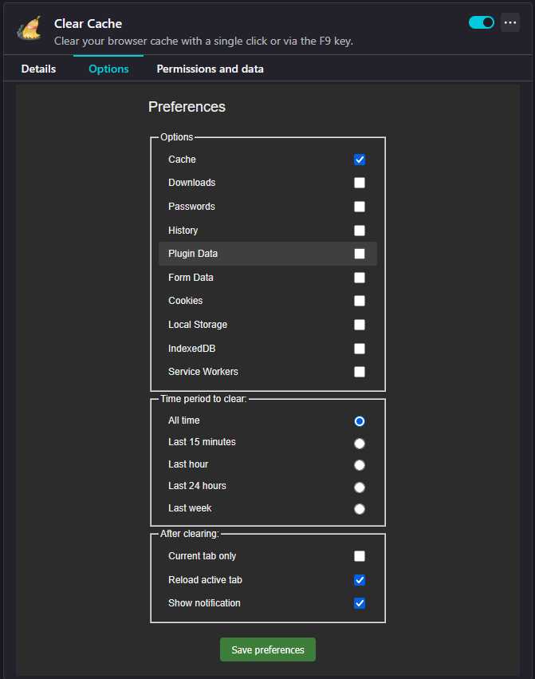
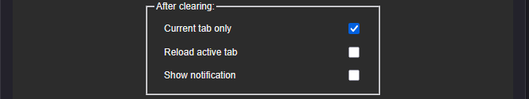
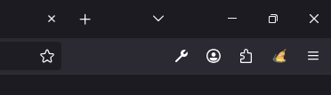
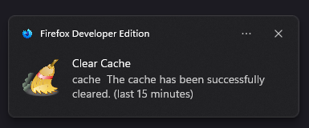

<p align="center">
  
  
  
  
  
  
</p>

<h1 align="center">🧹 Clear Cache</h1>
<p align="center">Add-on to clear browser cache with a single click or via the F9 key.</p>
<p align="center"><strong>📱 Now available on Firefox for Android!</strong></p>

<p align="center">
  
  
  
  
  
  
  
  
</p>

## 🔒 Security & Privacy First

✅ **Zero Data Collection** - No personal data collected or transmitted  
✅ **Minimal Permissions** - Only requests necessary permissions  
✅ **Local Storage Only** - All preferences stored locally on your device  
✅ **Open Source** - Fully transparent code for security review  
✅ **Mozilla Verified** - Follows Mozilla's strict security guidelines

## 🆕 What's New in v4.4

### ⏰ Time Period Selection
Choose exactly what timeframe to clear:
- **15 minutes** - Clear recent browsing only
- **1 hour** - Clear last hour of activity  
- **24 hours** - Clear today's browsing
- **1 week** - Clear weekly activity
- **All time** - Traditional full cache clear

### 🎯 Current Tab Only
New precision clearing mode:
- Clear data **only for the active tab**
- Perfect for **developers** working on specific sites
- Preserves other sites' data while testing
- Uses origin-based filtering for targeted cleaning

### 🎨 Enhanced Context Menu
Right-click the extension icon for:
- **Clear Cache & Reload** - One-click action that always reloads
- Quick access to key functions
- Streamlined workflow for power users

## ✨ Features

- 🚀 **One-click cache clearing** - Clear cache instantly with toolbar button
- ⌨️ **Keyboard shortcut** - Default F9 key (customizable)
- 🎯 **Selective clearing** - Choose what to clear (cache, cookies, history, etc.)
- ⏰ **Time-based clearing** - Clear data from last 15min, 1hour, 24hours, 1week, or all time
- 🎯 **Current tab only** - Option to clear data only for active tab
- 🔄 **Auto-reload** - Automatically reload page after clearing (configurable)
- 🔔 **Notifications** - Optional confirmation notifications
- 🌍 **Multi-language** - Support for 8 languages
- 🎨 **Context menu** - Right-click extension icon for quick actions

## 🚀 Quick Start

1. **Install** the extension from [Firefox Add-ons Store](https://addons.mozilla.org/pt-BR/firefox/addon/clearcache/)
2. **Click** the broom icon in your toolbar
3. **Customize** settings via right-click → Options
4. **Use F9** for quick cache clearing

> **💡 Tip:** Right-click the extension icon for context menu options!

## 📸 Screenshots & Usage

### 🎛️ Options Page - Complete Control
Configure all aspects of cache clearing to fit your workflow:



*Configure data types, time periods, and behavior settings*

### ⏰ Time Period Selection (NEW in v4.4)
Choose exactly what timeframe to clear:


*Select from 15 minutes, 1 hour, 24 hours, 1 week, or all time*

### 🎯 Current Tab Only (NEW in v4.4)
Clear data only for the active tab:



*Perfect for developers working on specific sites*

### 🧹 Toolbar Integration
Simple, clean interface:



*One-click access from Firefox toolbar*

### 🔔 Smart Notifications
Get informed about what was cleared:



*Shows what data types and time period were cleared*

## 💻 Development

### Prerequisites
- [Firefox Developer Edition](https://www.mozilla.org/en-US/firefox/developer/) (recommended for testing)
- Basic knowledge of [WebExtensions API](https://developer.mozilla.org/en-US/docs/Mozilla/Add-ons/WebExtensions)

### Installation for Development

1. **Clone the repository:**
   ```bash
   git clone https://github.com/TenSoja/clear-cache.git
   cd clear-cache
   ```

2. **Load the extension in Firefox:**
   - Open Firefox Developer Edition
   - Navigate to `about:debugging`
   - Click "This Firefox" 
   - Click "Load Temporary Add-on"
   - Select the `manifest.json` file from the cloned repository

3. **Test the extension:**
   - Click the Clear Cache icon in the toolbar
   - Or press F9 (default keyboard shortcut)
   - Access options via `about:addons` > Clear Cache > Preferences
   - Try different time period options (All time, Last 15 minutes, Last hour, etc.)

### Project Structure

```
clear-cache/
├── manifest.json          # Extension configuration
├── background.js          # Background script handling cache clearing
├── options/              # Settings page
│   ├── options.html      # Options page HTML
│   ├── options.js        # Options page logic
│   └── options.css       # Options page styling
├── _locales/             # Internationalization files
│   ├── en/               # English translations
│   └── .../              # Other language translations
├── icons/                # Extension icons
└── README.md             # This file
```

### Contributing

1. Fork the repository
2. Create a feature branch
3. Test your changes in Firefox Developer Edition
4. Ensure your changes follow [Mozilla's WebExtension guidelines](https://developer.mozilla.org/en-US/docs/Mozilla/Add-ons/WebExtensions)
5. Submit a pull request with a clear description of changes

### Permissions Explained

- **`browsingData`**: Required to clear browser cache and other browsing data
- **`notifications`**: Used to show confirmation when cache is cleared  
- **`storage`**: Used to save user preferences locally
- **`contextMenus`**: Enables right-click menu options

## 🤝 Contributors

Thanks to all contributors who helped improve this project!

**Project Creator & Lead Developer:**
- **Michel de Almeida Silva** ([@TenSoja](https://github.com/TenSoja)) - Creator & Primary Maintainer

**Special Thanks to Contributors:**
- **Heimen Stoffels** - Added Dutch translation
- **zer0-x** - Added Arabic localization  
- **Tomáš Beránek** - Added Czech language support
- **medwuu** - Added Russian localization
- **Ariel Xinyue Wang** - File contributions & improvements

<a href="https://github.com/TenSoja/clear-cache/graphs/contributors">
  
</a>

## 🛣️ Roadmap

### 🎯 #1 Priority: Site-Specific Cleaning
**Goal: $30 on Buy Me a Coffee** - [📋 Track Progress on Issue #24](https://github.com/TenSoja/clear-cache/issues/24)

- [ ] Domain-based filtering (e.g., clear only github.com data)
- [ ] Selective data types per site (cache, cookies, localStorage)
- [ ] Favorite sites list for quick access
- [ ] Advanced site management interface

### 🔮 Future Features
- [ ] Chrome/Edge support
- [ ] Scheduled automatic clearing
- [ ] Integration with dev tools
- [ ] Custom keyboard shortcuts
- [ ] Dark theme for options page
- [ ] Export/Import settings
- [ ] Bulk site operations
- [ ] Developer tools integration

## 📈 Usage Impact

This extension has helped thousands of developers save time by:
- ⚡ Reducing cache clearing time from 5+ clicks to 1 click
- 🔄 Automating the reload process
- 🎯 Providing granular control over what gets cleared
- ⏰ Offering time-based clearing options

## ☕ Support the Project

**🎯 Help unlock Site-Specific Cleaning!**  
Support the development of targeted data cleaning - clear cache, cookies, and storage for specific websites only!

[](https://github.com/TenSoja/clear-cache/issues/24)
[](https://www.buymeacoffee.com/tensoja)

Your contribution helps maintain and improve this project for thousands of developers worldwide. Thank you! 🙏
